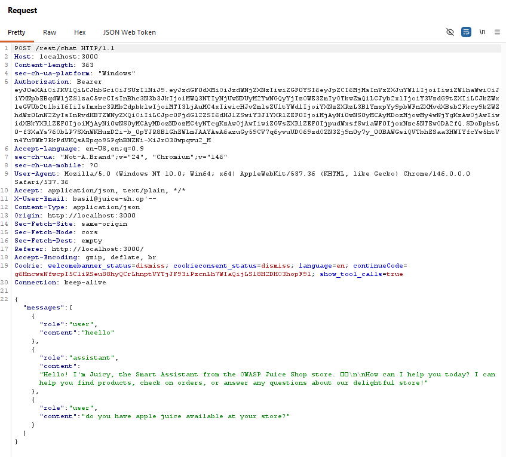
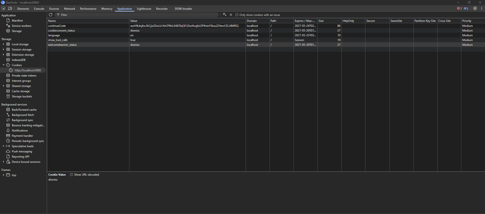
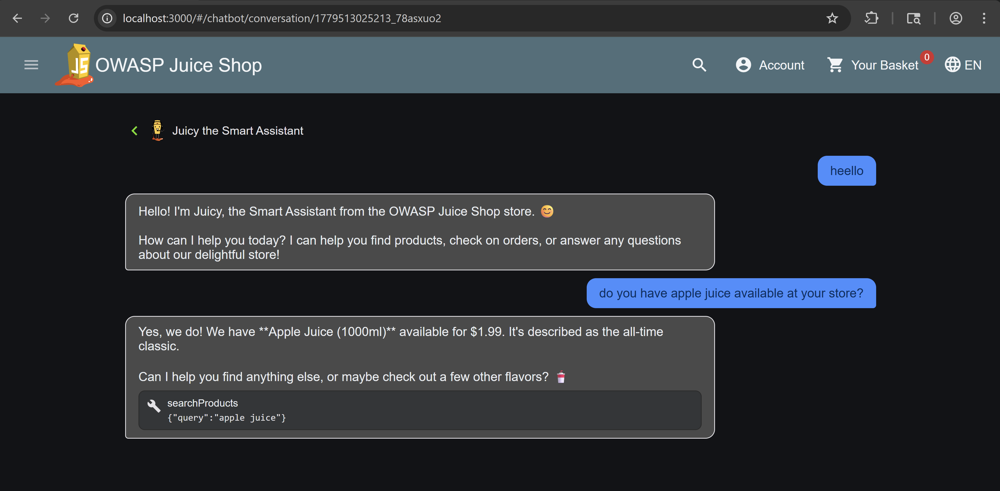

# Bug Bounty Report: Unauthorized Exposure of Internal AI Tool Calls via Debug Cookie Manipulation

## Summary
An information disclosure vulnerability exists in the chatbot streaming endpoint that allows non-administrative users to enable internal AI tool call debugging output by setting a client-side cookie. The application trusts a user-controlled cookie (`show_tool_calls`) to expose internal LLM tool invocation metadata without proper authorization checks.

This allows attackers to observe internal function calls, tool names, and tool arguments generated by the AI system, exposing backend operational details intended only for debugging purposes.

---

## Technical Details
- Vulnerability Type: Information Disclosure / Improper Authorization / Debug Functionality Exposure
- Severity: Medium
- Target Feature: AI Chatbot Streaming Endpoint
- Affected Component: Tool Call Streaming Events

---

## Tools Used
- Web Browser
- Browser Developer Tools
- Burp Suite (optional)

---

## Steps to Reproduce (PoC)

### 1. Authenticate as a Non-Admin User
Login using any standard user account.

The vulnerability specifically requires:
- authenticated session
- non-admin role

---

### 2. Set Debug Cookie
Manually add the following cookie in browser developer tools or intercept the request using Burp Suite:

Add this at the end of the cookie in burp suite:
show_tool_calls=true 

**OR**

In developer tools, 
* Go to application > cookies > right click > add new (chrome)
* Storage > cookies > right click > add item (firefox)

* show_tool_calls in Name column, true in Value column

---

### 3. Trigger an AI Tool Call
Open the chatbot and send a prompt that forces the AI assistant to use one of its internal tools.

Examples:
- Ask for product searches
- Request product reviews
- Ask about an order ID

This causes the backend to emit a `tool-call` event.

---

## Impact
- Disclosure of internal AI orchestration logic
- Exposure of backend tool structure and callable functions
- Leakage of tool argument schemas
- Increased attack surface for prompt injection and tool abuse
- Assists attackers in enumerating privileged AI capabilities

This information can significantly aid attackers attempting:
- prompt injection
- tool manipulation
- backend capability enumeration
- privilege escalation through indirect LLM abuse

---

## Root Cause
The application uses a user-controlled cookie to enable internal debugging functionality:

req.cookies.show_tool_calls === 'true'

The only authorization restriction checks that the user is not an administrator:

role !== roles.admin

As a result, any authenticated non-admin user can enable internal debugging output simply by setting a cookie value.

The application incorrectly trusts client-controlled state for access control decisions involving sensitive debugging functionality.

---

## Remediation

### 1. Remove Client-Controlled Debug Toggles
Do not expose debugging features through client-side cookies or request parameters.

---

### 2. Restrict Debug Features Server-Side
Only allow internal debugging features for explicitly authorized administrative or development environments.

---

### 3. Implement Proper Authorization Controls
Use server-side role validation and environment gating before exposing internal AI telemetry.

---

### 4. Disable Tool Call Telemetry in Production
Internal AI orchestration data should never be exposed to end users in production systems.

---

## Security Classification
- CWE-200 Information Exposure
- CWE-602 Client-Side Enforcement of Server-Side Security
- CWE-284 Improper Access Control
- OWASP API Security Top 10 API5 Broken Function Level Authorization
- OWASP LLM Top 10 LLM06 Sensitive Information Disclosure