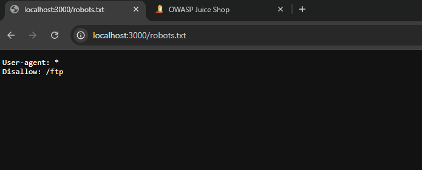
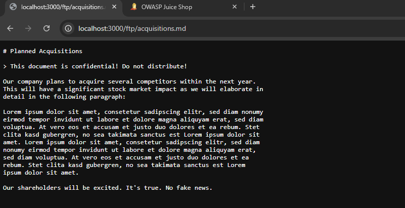

# Bug Bounty Report: Sensitive Information Disclosure via Unsecured FTP Server

## Summary
An information disclosure vulnerability allows unauthenticated attackers to discover and access a publicly exposed FTP directory via `robots.txt`. Attackers can download confidential corporate documents, compromising data confidentiality.

---

## Technical Details
* **Vulnerability Type:** Sensitive Data Exposure / Missing Access Control
* **Severity:** High

---

## Tools
* **Web Browser**

---

## Steps to Reproduce (PoC)

### 1. Information Reconnaissance
Append `/robots.txt` to the base URL to review crawler instructions. The file explicitly exposes a hidden directory:

User-agent: *
Disallow: /ftp

### 2. Accessing the FTP Server
Navigate directly to the leaked path to bypass authentication and list the directory contents:
* Go to `http://localhost:3000/ftp`

### 3. Exfiltrating Confidential Data
Locate and download the sensitive file directly from the open directory without credentials:
* Click the confidential document link.

---

## Remediation
1. **Enforce Access Control:** Restrict the `/ftp` path to authorized administrative sessions only.
2. **Disable Directory Browsing:** Configure the web server to disable directory listing for public folders.
3. **Clean Robots.txt:** Remove sensitive paths from `robots.txt`. Use proper server-side authentication to restrict access instead of relying on crawler exclusions.