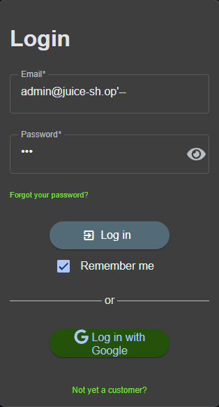

# Login Admin

## Summary
The application features multiple critical flaws within its authentication workflow that allow an attacker to gain full administrative privileges without possessing valid credentials. This report documents two independent methodologies used to compromise the administrator account: a 1-Star SQL Injection bypass that exploits improper backend query handling, and a 2-Star Automated Dictionary Attack that exploits a weak password policy.

---

## Technical Details
* Vulnerability Type: SQL Injection (SQLi) / Weak Password Policy
* Severity: Critical
* Target Endpoint: /rest/user/login

---

## Tools Used
* Web Browser (for SQL Injection input)
* Burp Suite Intruder
* SecLists Dictionary File: worst-passwords-2017-top100-slashdata.txt (via github.com/danielmiessler/SecLists)

---

## Steps to Reproduce (PoC)

### Target Identification (Reconnaissance)
Before executing either attack vector, the target administrator email address must be uncovered. Navigating to the product details for Apple Juice reveals a public review left by the administrator, exposing the target email identity: admin@juice-sh.op.

---

### Solution 1: SQL Injection Bypass 

1. Navigate to the login screen at http://localhost:3000/#/login.
2. Enter one of the following structural payload into the Email field: 
    * ' OR 1=1--
    * admin@juice-sh.op'--
3. Enter any arbitrary string into the Password field (e.g., password123).
4. Click the Log in button.

#### Why It Works

When a user attempts to authenticate normally, the backend web application dynamically constructs a Structured Query Language (SQL) statement to verify the credentials against the database. The pre-compiled database query template typically looks like this:

SELECT * FROM Users WHERE email = 'USER_INPUT' AND password = 'PASSWORD_INPUT';

In a legitimate authentication scenario, the user-supplied values are dropped cleanly into the input fields, maintaining the intended logic of the query:

SELECT * FROM Users WHERE email = 'user@email.com' AND password = 'user123';

However, when structural SQL characters are introduced into the email input field, the application treats the input as executable code rather than plain text data. 

---

### Scenario A: Exploit via Admin Comment Injection
If an attacker targets a specific account identity (e.g., admin@juice-sh.op) and appends the SQL comment indicator (--), the query breaks down as follows:

SELECT * FROM Users WHERE email = 'admin@juice-sh.op'--' AND password = 'PASSWORD_INPUT';

* Mechanics: The single quote closes the string literal parameter for the email early. The double-dash (--) instructs the database engine to treat everything following it as a comment. The server completely discards the password validation check, executing the authentication logic solely based on whether the email address exists.

---

### Scenario B: Exploit via Tautology Logic (OR 1=1)
If an attacker uses a universally true statement (a tautology) combined with a comment indicator, the query is rewritten structurally:

SELECT * FROM Users WHERE email = '' OR 1=1--' AND password = 'PASSWORD_INPUT';

* Mechanics: The database engine evaluates the statement from left to right. The first condition evaluates whether an email matches an empty string, which returns FALSE. However, the OR operator forces the database to evaluate the secondary condition: "Does 1 equal 1?" 
* Logic Gate Resolution: Because 1=1 is a mathematical absolute truth, that condition resolves to TRUE. In boolean logic, FALSE OR TRUE always results in TRUE. Combined with the comment indicator (--) wiping out the password verification block, the database processes the query as globally valid for all rows. 

Since the condition resolves as completely valid without a password check, the web application authenticates the session using the first record returned by the database. In standard deployment environments, the very first index entry in the user database table is historically the administrator account.

---

### Methodology B: The Automated Brute-Force Crack

1. Input the known target email (admin@juice-sh.op) into the login panel, enter a placeholder string in the password field, ensure Burp Intercept is active, and submit the form.
2. Locate the captured POST /rest/user/login request inside Burp Suite and forward it to the Intruder module (Ctrl + I).

3. Set the attack configuration pattern to Sniper. Apply the payload injection markers strictly around the placeholder password string within the JSON request body payload:
{"email":"admin@juice-sh.op","password":"§placeholder§"}

4. Move to the Payloads tab, set the type parameter to Simple List, click Load, and import the worst-passwords-2017-top100-slashdata.txt text file downloaded from the public Daniel Miessler SecLists repository.

5. Click Start Attack. Monitor the active results panel. While failing password sequences generate standard HTTP 401 Unauthorized transaction flags, the password payload string "admin123" prompts an HTTP 200 OK success response.

6. Review the raw response dataset. The server delivers a valid JSON Web Token (JWT) identifying the session holder as the system administrator, completing the account takeover.

---

## Remediation

1. Implement Parameterized Queries (Prepared Statements): To neutralize the SQL Injection vector completely, the development team must abandon raw query string concatenation. Utilizing prepared statements ensures that user-supplied input parameters are treated strictly as data literals rather than executable SQL syntax commands.
2. Enforce Account Lockout and Rate Limiting: Deploy strict rate-limiting policies or account lockouts on the /rest/user/login endpoint to dynamically suspend login traffic after five consecutive incorrect attempts. This blocks automated dictionary scanning utilities.
3. Enforce Strong Password Complexity: Establish robust client-side and server-side input validation requirements that reject weak, common dictionary passwords and mandate a secure minimum length configuration (e.g., 12+ characters containing symbols, numbers, and case variations).