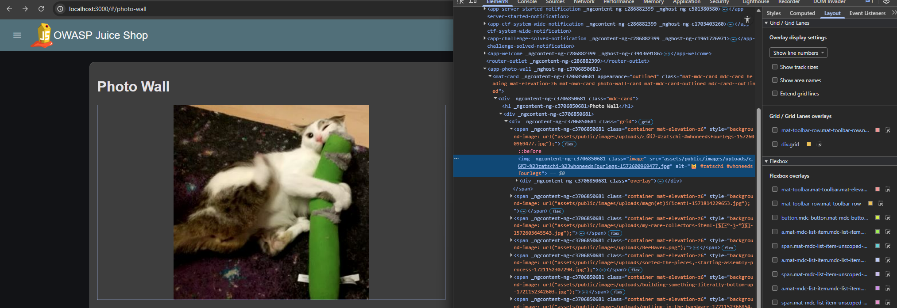

# Bug Bounty Report: Broken Image Rendering via Missing URL Encoding 

## Summary
An Improper Input Validation vulnerability on the "Photo Wall" page causes the application to fail to properly URL-encode special characters (specifically `#`) within image filenames. Because the browser interprets the hash symbol as a URL fragment identifier, the resource request is cut short, leading to a broken image link and failure to render client-side assets.

---

## Technical Details
* **Vulnerability Type:** Improper Input Validation / Missing URL Encoding
* **Severity:** Low
* **Target Page:** `/#/photo-wall`

---

## Tools Used
* **Web Browser Developer Tools** (F12 Elements/Network tab) or **Burp Suite Proxy**

---

## Steps to Reproduce (PoC)

### 1. Locate the Broken Resource
Navigate to the Photo Wall page from the application sidebar menu. Observe that the first image (the photo of Bjoern's cat) fails to load and displays a broken image icon.

### 2. Inspect the Source Code
Right-click the broken image placeholder and select **Inspect** to view its DOM attributes. Note the raw, unencoded filename assigned to the `src` attribute:

``

### 3. Analyze the Network Request Failure
Open the browser's **Network** tab and refresh the page. Look at the outgoing request for the broken image. The browser cuts the request path off right before the first `#` character, requesting only:

`http://localhost:3000/assets/public/images/uploads/ᓚᘏᗢ-`

Because the hash character is interpreted by the browser as a client-side fragment rather than text, the server responds with a `404 Not Found`.

### 4. Exploit via Manual Encoding
To fix the request path manually, replace the `#` characters with their hex URL-encoded equivalent (`%23`). 

Manually type the fully encoded URL into the address bar:

`http://localhost:3000/assets/public/images/uploads/ᓚᘏᗢ-%23zatschi-%23whoneedsfourlegs-1572600969477.jpg`

Hit **Enter**. The image fetches successfully from the backend, rendering the cat photo and triggering the challenge completion.

---

## Remediation

1. **Implement Server-Side Sanitization and Encoding:** Ensure that any dynamically generated URLs or filenames containing special characters (`#`, `?`, `&`, emojis) are safely processed through a URL-encoding function (such as JavaScript's `encodeURIComponent()`) before being injected into the HTML DOM.
2. **Enforce Strict File Naming Policies:** Restrict asset upload features from saving filenames containing special control characters or symbols that have specific syntactical meanings within standard URL specifications (RFC 3986).