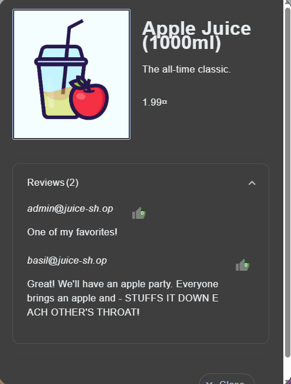
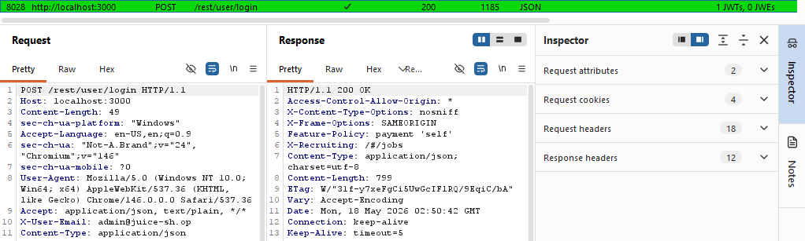
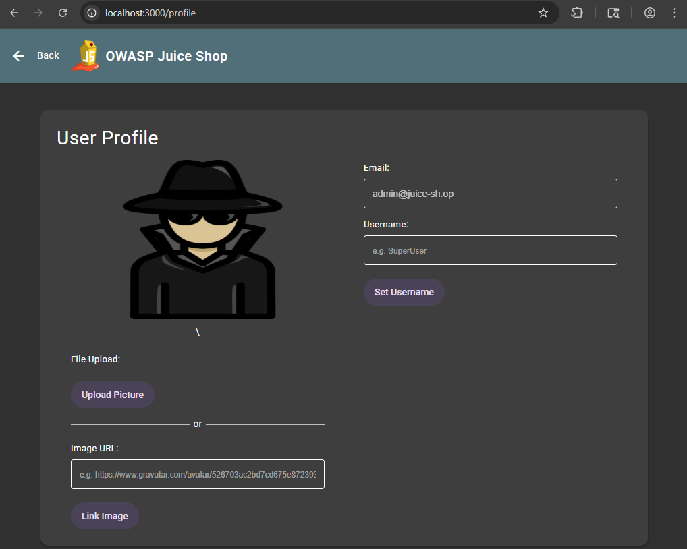

# Password Strength 

## Summary
The application's administrative authentication mechanism fails to enforce adequate password complexity standards or implement account lockout mechanisms. This security misconfiguration allows an attacker to conduct automated, high-velocity dictionary attacks against default user accounts, successfully bypassing administrative access controls using highly predictable credential lists.

---

## Technical Details
* Vulnerability Type: Weak Password Policy / Lack of Rate Limiting
* Severity: Medium
* Target Endpoint: /rest/user/login

---

## Tools Used
* Burp Suite Intruder
* SecLists Dictionary File: worst-passwords-2017-top100-slashdata.txt (via github.com/danielmiessler/SecLists)

---

## Steps to Reproduce (PoC)

### 1. Identify Target Account 
Under the review of the apple juice, an email starting with admin can be seen. We can assume that this is the email of the admin account. 

### 2. Configure Burp Intruder Attack
Locate the intercepted login request in Burp Suite:
POST /rest/user/login HTTP/1.1

Right-click the request panel and select Send to Intruder (or press Ctrl + I). Navigate to the Intruder positions tab, change the attack type to Sniper, and wrap the insertion markers exclusively around the placeholder password value within the JSON body string:

{"email":"admin@juice-sh.op","password":"§placeholder§"}

### 3. Load the Wordlist Payload
Navigate to the Payloads tab. Set the payload type to Simple List. Click Load and select the locally downloaded worst-passwords-2017-top100-slashdata.txt dictionary file sourced from the Daniel Miessler SecLists repository.

### 4. Execute and Analyze the Brute Force
Click Start Attack. Monitor the automated attack results table. While incorrect password attempts return an HTTP status code of 401 Unauthorized, an attempt using the password string admin123 returns an HTTP status code of 200 OK.

### 5. Verify Administrative Access
Review the response block for the successful payload entry. The server delivers an active JSON Web Token (JWT) authorizing full administrative access to the user profile session.

---

## Remediation

1. Implement Account Lockout Policies: Configure the backend authentication engine to automatically lock or temporarily suspend user accounts following a set threshold of consecutive failed authentication attempts (e.g., 5 attempts).
2. Enforce Strict Password Complexity Rules: Establish a robust validation mechanism requiring all passwords to meet a minimum length restriction (e.g., 12+ characters) and contain a mix of uppercase letters, numbers, and special symbols.
3. Deploy Server-Side Rate Limiting: Apply rate-limiting controls (such as a CAPTCHA or absolute request-per-minute ceilings) to the /rest/user/login API route to completely neutralize high-speed automated cracking utilities.